<div align="center">

# 🔐 DaManage

### *Secure Password Management, Simplified*

[](https://flutter.dev)
[](https://nodejs.org)
[](https://www.mysql.com)
[](https://en.wikipedia.org/wiki/Galois/Counter_Mode)
[](https://jwt.io)

<p align="center">
  <em>A modern, cross-platform password manager built with Flutter and Node.js</em>
</p>

[Features](#-features) •
[Quick Start](#-quick-start) •
[Architecture](#️-architecture) •
[Security](#-security) •
[API](#-api-endpoints) •
[Contributing](#-contributing)

</div>

---

## 📋 Table of Contents

- [✨ Features](#-features)
- [🚀 Quick Start](#-quick-start)
  - [Prerequisites](#prerequisites)
  - [Backend Setup](#1️⃣-backend-setup)
  - [Frontend Setup](#2️⃣-frontend-setup)
- [🏗️ Architecture](#️-architecture)
- [🔒 Security](#-security)
- [📦 Project Structure](#-project-structure)
- [🌐 API Endpoints](#-api-endpoints)
- [🛠️ Troubleshooting](#️-troubleshooting)
- [🤝 Contributing](#-contributing)

---

## ✨ Features

<table>
<tr>
<td width="50%">

### 🔐 Security First
- **AES-256-GCM** encryption for vault items
- **Bcrypt** password hashing
- **JWT** authentication
- Secure key management

</td>
</tr>
<tr>
<td width="50%">

### 🚀 Performance
- Lightweight Node.js backend
- Embedded SQLite database (zero external server)
- Fast encryption/decryption
- Minimal resource footprint

</td>
<td width="50%">

### 📱 Platform Support
- 🖥️ Windows, macOS, Linux
- 📱 Android & iOS
- 🌐 Web (Progressive Web App)
- ☁️ Cloud-ready architecture

</td>
</tr>
</table>

---

## 🚀 Quick Start

### Prerequisites

Before you begin, ensure you have the following installed:

| Tool | Version | Purpose |
|------|---------|---------|
| 🟢 **Node.js** | v18+ | Backend runtime |
| 📦 **npm** | Latest | Package management |
| 🎯 **Flutter SDK** | Latest | Frontend framework |
| 💠 **PowerShell 7+** *(Windows only)* | Latest | Helper scripts |

> 💾 **Database**: The backend now uses an embedded SQLite database. No separate database server is required—the schema is applied automatically on first run.

### 1️⃣ Backend Setup

#### Step 1: Initialize Environment & Database

- **Windows (recommended):** Run the helper script once to generate secrets, configure the environment file under `%LOCALAPPDATA%\DaManage`, and create the SQLite database in the same folder:

  ```powershell
  pwsh -File .\usdm-backend\Start-Backend.ps1
  ```

  Subsequent launches will reuse the generated `.env` and database.

- **Cross-platform manual setup:**
  ```bash
  cd usdm-backend
  cp .env.example .env
  ```
  Then edit `.env` with your preferred paths and secrets. By default the backend will create `./data/usdm.db` on startup.

#### Step 2: Configure Environment Variables (manual setup)

```env
# Server
PORT=3000
ALLOWED_ORIGINS=http://localhost:3000,http://localhost:5173

# SQLite Database (choose ONE of the following)
# Absolute path (recommended for production/Windows helper script)
DB_PATH=C:\\Users\\you\\AppData\\Local\\DaManage\\usdm.db
# or relative path inside the repo
# DB_FILE=./data/usdm.db

# JWT secret (hex) - generated automatically by Start-Backend.ps1 when missing
JWT_SECRET=your_hex_secret_here

# Vault Encryption Key (Base64 32 bytes)
VAULT_KEY=your_base64_key_here

# Optional security audit log directory
# AUDIT_LOG_PATH=C:\\Users\\you\\AppData\\Local\\DaManage\\logs
```

💡 **Generate secrets manually (if not using the script):**

```bash
node -e "const crypto=require('crypto');
console.log('JWT_SECRET=', crypto.randomBytes(32).toString('hex'));
console.log('VAULT_KEY=', crypto.randomBytes(32).toString('base64'));"
```

#### Step 3: Install & Run

```bash
# Install dependencies
npm install

# Development mode (with auto-reload)
npm run dev

# Production mode
npm start

# Windows helper script (auto-loads .env from AppData)
pwsh -File Start-Backend.ps1
```

### 2️⃣ Frontend Setup

#### Step 1: Install Dependencies

```bash
# Navigate to frontend directory
cd usdm_gui

# Get Flutter dependencies
flutter pub get
```

#### Step 2: Run the Application

```bash
# Desktop (Windows/macOS/Linux)
flutter run -d windows  # or macos, linux

# Web
flutter run -d chrome

# Android Emulator
flutter run -d emulator

# With custom API URL
flutter run --dart-define=API_BASE_URL=http://your-server:3000
```

📱 **Android Network Configuration:**
- Emulator automatically uses `http://10.0.2.2:3000`
- Physical device requires your computer's LAN IP

---

## 🏗️ Architecture

```mermaid
graph TB
    subgraph Frontend["🎨 Flutter Frontend"]
        UI[User Interface]
        API[API Client]
        Storage[Local Storage]
    end
    
    subgraph Backend["⚙️ Node.js Backend"]
        Express[Express Server]
        Auth[JWT Auth]
        Crypto[AES-256-GCM]
    end
    
    subgraph Database["💾 SQLite Database"]
        Users[Users Table]
        Vault[Vault Items Table]
    end
    
    UI --> API
    API --> Express
    Express --> Auth
    Auth --> Crypto
    Crypto --> Users
    Crypto --> Vault
```



### Tech Stack

| Layer | Technology | Purpose |
|-------|-----------|---------|
| **Frontend** | Flutter (Dart) | Cross-platform UI framework |
| **Backend** | Node.js + Express | RESTful API server |
| **Database** | SQLite 3 (file-based) | Embedded relational storage |
| **Authentication** | JWT | Stateless auth tokens |
| **Encryption** | AES-256-GCM | Vault data encryption |
| **Password Hashing** | Bcrypt | User password protection |

---

## 🔒 Security

### 🛡️ Security Measures

| Component | Implementation | Description |
|-----------|----------------|-------------|
| **User Passwords** | Bcrypt (12 rounds) | One-way hashing, cannot be decrypted |
| **Vault Items** | AES-256-GCM | Symmetric encryption with server key |
| **Authentication** | JWT | Signed tokens with expiry |
| **Transport** | HTTPS (prod) | Encrypted data transmission |
| **CORS** | Restricted origins | Prevents unauthorized access |
| **Rate Limiting & Brute Force** | express-rate-limit + custom lockouts | Protects auth endpoints |
| **Security Auditing** | Structured log files | Tracks sensitive events & suspicious activity |

### ⚠️ Security Best Practices

> **🔐 Keep Your Secrets Safe**
> - Never commit `.env` files to version control
> - Use strong, random keys for `JWT_SECRET` and `VAULT_KEY`
> - Rotate secrets regularly in production
> - Enable HTTPS for all production deployments
> - Monitor security audit logs stored under `%LOCALAPPDATA%\DaManage\logs` (or `AUDIT_LOG_PATH`)


## 📦 Project Structure

```
DaManage/
│
├── 📂 usdm-backend/              # Node.js Backend
│   ├── 📄 server.js              # Main API server
│   ├── 📄 package.json           # Dependencies & scripts
│   ├── 📄 Start-Backend.ps1      # Windows helper (env + SQLite setup)
│   ├── 📄 schema.sql             # Database schema applied automatically
│   ├── 📄 .env.example           # Environment template
│   └── 📂 data/                  # Default SQLite location (auto-created)
│
├── 📂 usdm_gui/                  # Flutter Frontend
│   ├── 📂 lib/
│   │   ├── 📂 screens/           # UI screens
│   │   │   ├── home_screen.dart
│   │   │   ├── login_screen.dart
│   │   │   ├── signup_screen.dart
│   │   │   └── vault_screen.dart
│   │   ├── 📂 services/          # API & business logic
│   │   │   └── api_client.dart
│   │   └── 📂 widgets/           # Reusable components
│   ├── 📄 pubspec.yaml           # Flutter dependencies
│   └── 📂 android/ios/web/       # Platform-specific code
│
├── 📂 installer/                 # Distribution packages
│   └── 🔧 DaManage.iss           # Inno Setup script
│
├── 📄 README.md                  # This file
├── 📄 .gitignore                 # Git ignore rules
└── 📄 Start-DaManage.ps1         # Launches backend & packaged Flutter app

```

---

## 🌐 API Endpoints

### Authentication

| Method | Endpoint | Auth | Description | Request Body |
|--------|----------|------|-------------|--------------|
| `POST` | `/signup` | ❌ | Register new user | `{ username, password }` |
| `POST` | `/login` | ❌ | Authenticate user | `{ username, password }` |

**Response:**
```json
{
  "message": "Login successful",
  "token": "eyJhbGciOiJIUzI1NiIsInR5cCI6IkpXVCJ9..."
}
```

### Vault Management

> 🔒 All vault endpoints require JWT authentication via `Authorization: Bearer <token>` header

| Method | Endpoint | Description | Request Body |
|--------|----------|-------------|--------------|
| `GET` | `/vault` | List all vault items | - |
| `POST` | `/vault` | Create new vault item | `{ title, username, url, password, notes }` |
| `PUT` | `/vault/:id` | Update vault item | `{ title, username, url, password, notes }` |
| `DELETE` | `/vault/:id` | Delete vault item | - |

**Vault Item Response:**
```json
[
  {
    "id": 1,
    "title": "GitHub",
    "username": "user@example.com",
    "url": "https://github.com",
    "password": "••••••••",
    "notes": "Personal account",
    "created_at": "2025-01-01T12:00:00Z",
    "updated_at": "2025-01-01T12:00:00Z"
  }
]
```

---

## 🛠️ Troubleshooting

### Common Issues

<details>
<summary><b>❌ 401 Unauthorized on vault routes</b></summary>

**Cause:** Expired or invalid JWT token

**Solution:**
1. Re-login to obtain a fresh token
2. Verify `Authorization: Bearer <token>` header is set
3. Check JWT_SECRET matches between server and environment

</details>

<details>
<summary><b>📱 Mobile app cannot reach backend</b></summary>

**Cause:** Network configuration issue

**Solution:**
- **Android Emulator:** Use `http://10.0.2.2:3000`
- **Physical Device:** Use your computer's LAN IP
  ```bash
  flutter run --dart-define=API_BASE_URL=http://192.168.1.100:3000
  ```
- Ensure firewall allows connections on port 3000

</details>

<details>
<summary><b>💾 SQLite database issues</b></summary>

**Cause:** Incorrect `DB_PATH`/`DB_FILE` configuration or missing write permissions

**Solution:**
1. Confirm the database file exists (default `%LOCALAPPDATA%\DaManage\usdm.db` on Windows or `usdm-backend/data/usdm.db` otherwise).
2. Ensure the process has permission to create/write the chosen directory.
3. Delete the broken database file and restart the backend to recreate the schema.
4. If using manual `.env`, double-check that only one of `DB_PATH` or `DB_FILE` is set.

</details>

<details>
<summary><b>🔐 Encryption/Decryption errors</b></summary>

**Cause:** Invalid or changed `VAULT_KEY`

**Solution:**
1. Verify `VAULT_KEY` is a valid 32-byte Base64 string
2. **⚠️ Warning:** Changing the key will invalidate all existing vault data
3. Use the same key consistently across restarts

</details>

---


## 🤝 Contributing

We welcome contributions! Here's how you can help:

### 🔧 Development Setup

1. **Fork & Clone**
   ```bash
   git clone https://github.com/YOUR_USERNAME/DaManage.git
   cd DaManage
   ```

2. **Create Feature Branch**
   ```bash
   git checkout -b feature/your-amazing-feature
   ```

3. **Backend Development**
   ```bash
   cd usdm-backend
   cp .env.example .env
   # Edit .env with your config
   npm install
   npm run dev
   ```

4. **Frontend Development**
   ```bash
   cd usdm_gui
   flutter pub get
   flutter run
   ```

5. **Make Changes**
   - Write clean, documented code
   - Follow existing code style
   - Add tests where applicable
   - Update documentation as needed

6. **Commit & Push**
   ```bash
   git add .
   git commit -m "feat: add amazing feature"
   git push origin feature/your-amazing-feature
   ```

7. **Open Pull Request**
   - Provide clear description
   - Include screenshots for UI changes
   - Reference related issues


## 📄 License


---

<div align="center">

### ⭐ Star this repository if you find it helpful!

[Report Bug](https://github.com/Gr0osky/DaManage/issues) • 
[Request Feature](https://github.com/Gr0osky/DaManage/issues) • 
[Documentation](https://github.com/Gr0osky/DaManage/wiki)

</div>
